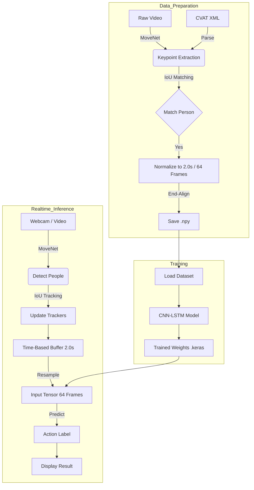

# Boxing Identification System (BIS)

This project implements a real-time action recognition system for boxing, capable of detecting and classifying moves (Jab, Cross, Hook, Uppercut) from video streams. It utilizes **MoveNet** for pose estimation and a custom **CNN-LSTM** network for temporal action classification.

## 1. Data Preparation (`MoveNet/extract_keypoints_to_2d.py`)
(**Refer: ./MoveNet/README.md and /MoveNet/EXTRACT_KEYPOINTS_TO_2D_GUIDE.md**) 
The data pipeline converts raw video footage into normalized keypoint sequences suitable for training.

*   **Input**: MP4 videos and CVAT XML annotation files.
*   **Pose Estimation**: Uses **MoveNet MultiPose Lightning** to detect keypoints.
*   **Track Extraction**: Parses XML annotations to isolate specific action clips.
*   **Person Matching**: Uses Intersection over Union (IoU) to match MoveNet detections with annotated bounding boxes, ensuring the correct person is tracked even in multi-person scenes.
*   **Pre-roll Context Extraction**: For actions shorter than 2.0s, the system automatically extracts preceding frames (pre-roll) from the video to fill the window with actual "idle" or "preparation" motion. This ensures the model sees the natural transition into the action, matching real-time inference conditions.
*   **Normalization**:
    *   **Temporal**: All clips are normalized to a fixed duration of **2.0 seconds** (resampled to **64 frames**).
    *   **Alignment**: Clips are **End-Aligned** (Right-Aligned). If an action is shorter than 2.0s, it is placed at the end of the window, with the beginning padded. This mimics the real-time inference buffer behavior for immediate responsiveness.
    *   **Spatial**: Keypoint coordinates are normalized to `[0, 1]`.
*   **Output**: `.npy` files containing keypoint sequences of shape `(51, 64)` (17 keypoints × 3 values × 64 frames).

## 2. Model Structure (`model_src/BIS.ipynb`)
(**Refer: ./model_src/BIS.ipynb**) 
The classification model is a hybrid **CNN-LSTM** architecture designed to learn spatiotemporal features.

*   **Input Shape**: `(Batch, 64, 17, 2, 1)` - (Time, Keypoints, Coordinates, Channels).
*   **Spatial Feature Extraction (CNN)**:
    *   **TimeDistributed Conv2D Layers**: Apply convolution to each frame independently to extract spatial relationships between keypoints.
    *   **MaxPooling**: Reduces spatial dimensionality.
*   **Temporal Feature Extraction (LSTM)**:
    *   **LSTM Layers**: Process the sequence of spatial features to understand the motion dynamics over time.
*   **Classification Head**:
    *   **Dense Layers**: Fully connected layers with Dropout for regularization.
    *   **Softmax Output**: Probabilities for 4 classes: `Cross`, `Uppercut`, `Rear Hook`, `Jab`.

## 3. Full Video Labeling (`MoveNet/realtime_inference.py`)
(**Refer: ./MoveNet/README.md and ./MoveNet/REALTIME_INFERENCE_GUIDE.md**) 
The inference script performs live detection and classification.

*   **Multi-Person Tracking**: Detects and tracks multiple people simultaneously using a sliding window approach.
*   **Time-Based Buffer**: Maintains a **2.0-second history** for each person, regardless of the camera's FPS.
*   **Dynamic Resampling**: Interpolates the variable-length history buffer into exactly **64 frames** to match the model's input requirement.
*   **Robustness**: Handles missing detections by interpolating across gaps, preventing "teleportation" artifacts in the data stream.
*   **Visualization**: Draws bounding boxes, keypoints, and classification labels with confidence scores in real-time.

## Workflow Diagram

